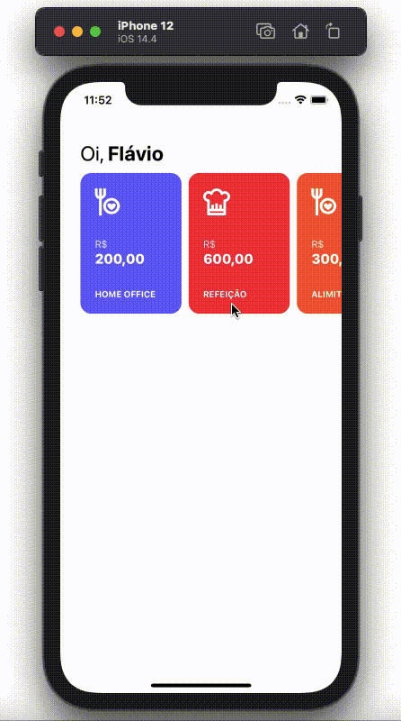

<h1 align="center">
  
</h1>

<p align="center">
  
  
  
  
</p>

<p align="center">
  <a href="#page_with_curl-sobre">Sobre</a>&nbsp;&nbsp;&nbsp;|&nbsp;&nbsp;&nbsp;
  <a href="#hammer-iniciando-mobile">Tecnologias</a>
  &nbsp;&nbsp;&nbsp;|&nbsp;&nbsp;&nbsp;
  <a href="#books-requisitos">Requisitos</a>&nbsp;&nbsp;&nbsp;|&nbsp;&nbsp;&nbsp;
  <a href="#rocket-começando">Começando</a>&nbsp;&nbsp;&nbsp;
</p>

<h1 align="center">
  
</h1>

## :page_with_curl: Sobre

Quando iniciei na minha atual empresa, a Calindra, tive a oportunidade de conhecer os benefícios da empresa [Caju](https://www.caju.com.br/).

A critério de estudos, resolvi criar a principal funcionalidade do app usando React native.

A Caju, é uma aplicação no qual o usuário pode transferir o seu saldo entre as categorias de benefícios, aumentando a sua possibilidade de uso.

Nessa aplicação meu principal objetivo foi aprender como funciona as navegações entre telas com passagem de parâmetros, utilizando [React Navigation](https://reactnavigation.org/) e uso [Context API](https://reactjs.org/docs/context.html) do React Hooks.

## :hammer: Tecnologias

Este projeto foi desenvolvido com as seguintes tecnologias:

- [Expo](https://expo.io/)
- [React Native](https://reactnative.dev/)
- [Javascript](https://www.javascript.com/)
- [React Navigation](https://reactnavigation.org/)
- [@expo/vector-icons](https://docs.expo.io/guides/icons/)
- [VS Code](https://code.visualstudio.com/) com [EditorConfig](https://editorconfig.org/), [ESLint](https://eslint.org/) e [Prettier](https://prettier.io/)

## :books: Requisitos

- Ter [**Git**](https://git-scm.com/) para clonar o projeto.
- Ter [**Node.js**](https://nodejs.org/en/) instalado.
- Um dispositivo ou emulador iOS ou Android

## :rocket: Começando

```bash
  # Clonar o projeto:
  $ git clone https://github.com/fsilvaco/react-native-caju-beneficios

  # Entrar no diretório:
  $ cd react-native-caju-beneficios

  # Instalar as dependências:
  $ yarn
```

## :iphone: Iniciando aplicação

```bash

  # Iniciar a aplicação:
  $ yarn start
```

Feito com ❤️ por Flávio Silva 👋🏻 [Get in touch!](https://www.linkedin.com/in/fsilvaco/)
